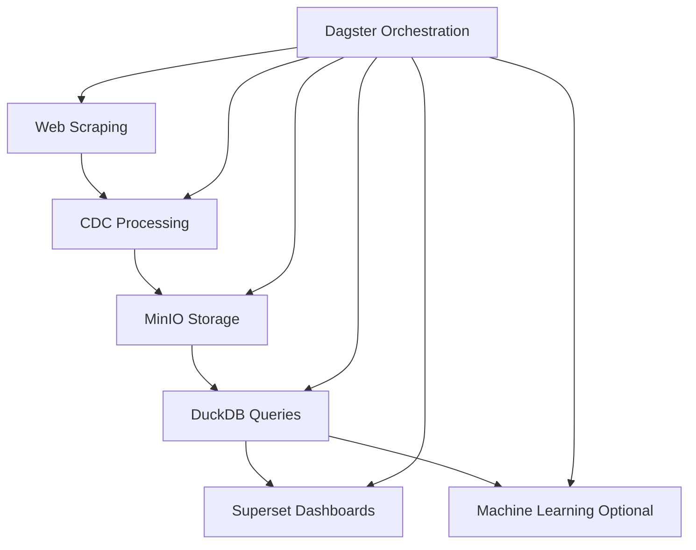

# 🎨 Real Estate Data Engineering Project - Enhanced Detailed README

## 🌟 Project Overview

This project presents a **full-scale data engineering pipeline** designed to handle real estate data end-to-end. We leverage cutting-edge open-source tools to scrape, transform, store, analyze, and visualize data seamlessly. Built to be **modular**, **scalable**, and **cloud-agnostic**, this architecture thrives in local and cloud environments.

---

## 🎯 Objectives

- 🌐 Scrape real estate listings from the web.
- 💾 Store datasets (raw & processed) in **MinIO** (S3-compatible object storage).
- 🔄 Apply **Change Data Capture (CDC)** to detect and process only new or updated data.
- ⚡ Query and transform data efficiently using **DuckDB**.
- 🎛️ Orchestrate the entire workflow with **Dagster**.
- 📊 Visualize insights via **Apache Superset**.
- 🐳 Deploy effortlessly using **Docker Compose**.

Perfect for real-time market analysis, price monitoring, and property insights.

---

## 🏗️ Visual Architecture



---

## 🧩 Component Details

### 🌐 Web Scraping
- **Purpose:** Extract real estate listings from websites.
- **Reason:** Many portals lack APIs. Scraping converts web data into structured CSVs.
- **Tools:** `BeautifulSoup`, `requests`.
- **Output:** Raw CSV files with property details.

### 🔄 Change Data Capture (CDC)
- **Purpose:** Detect new or updated listings.
- **Reason:** To avoid reprocessing identical data.
- **Method:** Property fingerprints for comparison.
- **Output:** Only new/updated records proceed.

### 💾 MinIO (S3-Compatible Storage)
- **Purpose:** Store raw and processed data.
- **Reason:** Cloud-agnostic storage resembling AWS S3.
- **Usage:** Organizes files into buckets.

### ⚡ DuckDB
- **Purpose:** Execute analytics on local data.
- **Reason:** Fast, lightweight, SQL-compatible engine for CSV-based analytics.
- **Usage:** Transform and analyze data pulled from MinIO.

### 🎛️ Dagster
- **Purpose:** Pipeline orchestration.
- **Reason:** Modular and observable workflow management.
- **Flow:** Scraping → CDC → MinIO → DuckDB → Results.

### 📊 Apache Superset
- **Purpose:** Visual analytics and dashboards.
- **Reason:** Open-source alternative to Tableau/Looker.
- **Use Cases:** Display trends, heatmaps, and business insights.

---

## 🔗 Component Interconnection

| Component | Input | Process | Output |
|-----------|-------|---------|--------|
| 🌐 Scraper | Website | Extract listings | Raw CSV |
| 🔄 CDC | CSV + History | Compare fingerprints | Updated CSV |
| 💾 MinIO | CSV files | Object storage | Persistent datasets |
| ⚡ DuckDB | CSV from MinIO | Transform with SQL | Analysis-ready data |
| 📊 Superset | DuckDB | Visualize | Dashboards |
| 🎛️ Dagster | Everything | Orchestration | Logs & monitoring |

---

## 📸 Screenshots

### 🐳 Docker Setup


### 🎛️ Dagster Pipeline Execution


### 💾 MinIO Storage


---

## ⚙️ Installation & Setup

### Requirements
- Docker + Docker Compose
- Python 3.10+
- Virtual Environment (`venv`)

### Setup
```bash
git clone https://github.com/your-repo/real-estate-data-engineering.git
cd real-estate-data-engineering
python3 -m venv venv
source venv/bin/activate
pip install -r requirements.txt
docker-compose up -d
dagster-webserver -h 0.0.0.0 -p 3000
```

### Access
- 🧭 Dagster: [http://localhost:3000](http://localhost:3000)
- 📂 MinIO: [http://localhost:9001](http://localhost:9001)
- 📊 Superset: [http://localhost:8088](http://localhost:8088)

---

## 🚀 Why This Stack?

- **Scalability:** Local or cloud-ready.
- **Modularity:** Swap components as needed.
- **Maintainability:** Clean, clear architecture.
- **Observability:** Full monitoring via Dagster.

---

## 🌱 Future Plans

- Integrate Delta Lake for advanced version control.
- Build ML models for dynamic price prediction.
- Automate Superset dashboard generation.
- CI/CD pipelines for streamlined production.

---

## 🎉 Conclusion

This project showcases end-to-end data engineering using the latest open-source tools. Ideal for learning, prototyping, or production-grade real estate insights.

Feel free to contribute via GitHub or connect on LinkedIn!
